# 🎧 CARA (C Acoustic Representation & Analysis): High-Performance Audio Signal Processing and Visualization Pipeline

**CARA** is a high-performance C library for audio signal processing and visualization, featuring Short-Time Fourier Transform (STFT), Mel spectrograms, Mel-Frequency Cepstral Coefficients (MFCC), and professional-grade heatmap visualizations. Optimized for large-scale audio datasets, it leverages [FFTW](http://www.fftw.org/) with wisdom caching, [OpenMP](https://www.openmp.org/) parallelization, and BLAS ([OpenBLAS](https://www.openblas.net/)) for fast matrix operations. The library supports multiple audio formats (WAV, FLAC, MP3) via [libsndfile](https://libsndfile.github.io/libsndfile/) and [minimp3](https://github.com/lieff/minimp3), and offers customizable visualizations with extensive color schemes.


## ✨ Key Features

- 🎧 **Audio I/O with Format Detection**  
  Automatic format detection and reading of WAV, AAC, MP3, and more.  
  MP3s are decoded via embedded [minimp3](https://github.com/lieff/minimp3); other formats use [libsndfile](https://libsndfile.github.io/libsndfile/).

- 📊 **Optimized Short-Time Fourier Transform (STFT)**  
  Uses FFTW with wisdom caching for optimal FFT performance.  
  Supports multiple window functions (Hann, Hamming, Blackman, Blackman-Harris, Bartlett, Flat-top, Gaussian, Kaiser).  
  Intelligent single/multi-threaded execution with per-thread FFTW plans.

- 🔊 **Generalized Filter Bank Processing**  
  Supports **6 perceptual and mathematical frequency scales**:
  - `F_MEL` – Mel scale (perceptual)
  - `F_BARK` – Bark scale (critical bands)  
  - `F_ERB` – Equivalent Rectangular Bandwidth
  - `F_CHIRP` – Chirp-based logarithmic scale
  - `F_CAM` – Cambridge ERB-rate scale
  - `F_LOG10` – Base-10 logarithmic spacing
  
  Built via `gen_filterbank()` with triangular filter construction, accelerated with BLAS matrix operations (`cblas_sgemm`).

- 🧠 **Frequency Cepstral Coefficients (FCC)**  
  Generalized cepstral analysis using precomputed DCT coefficients.  
  Highly optimized with BLAS operations and OpenMP parallelization.  
  Supports customizable coefficient counts and visualization.

- 🖼️ **Professional Visualization Engine**  
  Renders STFTs, filter bank spectrograms, and FCCs as high-resolution PNG heatmaps.  
  Features **130+ colormap variants** including scientific and OpenCV-style schemes.  
  Automatic frequency axis inversion for intuitive low-to-high frequency display.

- ⏱️ **Comprehensive Benchmarking**  
  Microsecond-precision timing for all processing stages.  
  Detailed parallel efficiency analysis and GFLOP/s measurements.  
  Multi-threading performance optimization with automatic load balancing.


- 🖼️ **Visualization**  
  Renders STFTs, filter bank spectrograms, and MFCCs as high-res PNG heatmaps using [libheatmap](https://github.com/lucasb-eyer/libheatmap).  
  Comes with **130+ colormap variants**:
  - 🎨 22 OpenCV-style colormaps  
  - 🌈 108 scientific colormaps (27 base × 4 variants: discrete, soft, mixed, mixed_exp)

- ⏱️ **Benchmarking**  
  Microsecond-resolution timing for STFT, filter bank application, MFCC, and plotting.  
  Includes ranked, color-coded bar graphs and outputs both raw and JSON-formatted logs for deeper analysis.

- ⚙️ **Performance Optimizations**  
  OpenMP parallelism, FFTW wisdom caching, BLAS matrix ops, and aggressive compiler optimizations including Link-Time Optimization (LTO), CPU-native code generation, and advanced loop transformations.

- 🐦 **Applications**  
  Ideal for:
  - Bioacoustics (e.g., bird call analysis — `tests/files/black_woodpecker.wav`, `tests/files/173.mp3`)
  - Machine learning feature extraction  
  - Batch audio pipelines  
  - Digital signal processing research

## 💡 Motivation

The main motivation behind this project was to gain a deeper understanding of both **C** and **digital signal processing (DSP)**. While there are countless tutorials on how to **use** MFCCs and Mel filter banks, very few actually explain how to **compute** them from scratch. The process was often fragmented or hidden behind library calls.

When searching for minimalist MFCC pipelines, I came across excellent projects like [rust-mfcc](https://github.com/bytesnake/mfcc), which performed impressively — about **2.5× faster than Librosa** on synthetic benchmarks ([Colab Notebook](https://github.com/8g6-new/mfcc_rust_bench/blob/master/rust_vs_python.ipynb)).  
However, they often rely on external dependencies and abstractions that obscure what's happening under the hood.

I noticed a lack of **simple, dependency-free, well-structured C implementations** of STFT, Mel spectrograms, and MFCCs that emphasize:

1. **Readability** – Code that beginners in C can actually follow  
2. **Educational Value** – A step-by-step DSP pipeline laid bare  
3. **Transparency** – Each transform is explicitly written (FFT, Mel bank, DCT)

As I built this project, I came to understand and appreciate:
- How **windowing**, **hop size**, and **FFT resolution** interact  
- The inner workings of **Mel filter bank construction**  
- How to derive **MFCCs using DCT**, and why the coefficients matter  
- The performance implications of **memory layout**, **cache locality**, and **contiguous memory access**  
- How small details like **loop nesting**, **BLAS vectorization**, and **data alignment** can drastically affect speed

This project serves as both a **clear, hackable, and minimalist reference** for students, hobbyists, and anyone who wants to learn DSP by building it from the ground up, while also achieving competitive performance with established libraries.

If it helps others demystify the DSP pipeline or write their own from scratch, then it's done its job.

## Pipeline Overview

```mermaid
%%{init: {
  "theme": "base",
  "themeVariables": {
    "primaryColor": "#1e1e1e",
    "primaryTextColor": "#ffffff",
    "primaryBorderColor": "#ffaa00",
    "clusterBkg": "#2a2a2a",
    "clusterBorder": "#ffaa00",
    "lineColor": "#ffaa00",
    "fontSize": "14px",
    "fontFamily": "monospace"
  }
}}%%

flowchart TD
    A["📥 Audio Input (.wav / .mp3)"] --> B["🔍 Auto File Type Detection"]
    B --> C{"🧩 Format Type"}
    C -->|MP3| D["🎧 Decode with minimp3"]
    C -->|Other| E["🎵 Read with libsndfile"]
    D --> F["🎚️ Normalize → Float32"]
    E --> F

    subgraph Feature Extraction
        F --> G["🪟 Apply Window Function (e.g., hann)"]
        G --> H["⚡ STFT (FFTW + Wisdom)"]
        H --> I["📊 Extract Magnitudes & Phases"]
        I --> J["🎚️ Apply Generalized Filter Bank (BLAS)"]
        J --> K["🎯 Compute FCC (DCT)"]
    end

    subgraph Visualization
        H --> V1["🖼️ STFT Heatmap"]
        J --> V2["🎨 Filter Bank Spectrogram"]
        K --> V3["🌡️ FCC Heatmap"]
    end

    subgraph Benchmarking
        H --> B1["⏱️ Time STFT"]
        J --> B2["⏱️ Time Filter Bank"]
        K --> B3["⏱️ Time FCC"]
        V1 --> B4["⏱️ Time Plot Generation"]
    end
```




## Requirements

- **Compiler**: GCC or Clang with C11 support.
- **Dependencies**:
  - **FFTW3** ([FFTW](http://www.fftw.org/)) for fast Fourier transforms.
  - **libsndfile** ([libsndfile](https://libsndfile.github.io/libsndfile/)) for WAV/FLAC file handling.
  - **OpenMP** ([OpenMP](https://www.openmp.org/)) for parallel processing.
  - **BLAS** (e.g., [OpenBLAS](https://www.openblas.net/)) for matrix operations.
  - **libpng** ([libpng](http://www.libpng.org/pub/png/libpng.html)) for PNG output.

## Installation

### Step 1: Install Dependencies

**Automated Installation:**
```bash
git clone --depth 1 https://github.com/8g6-new/CARA && cd CARA
make install  # Runs install_libs.sh for Ubuntu/Debian systems
```

**Manual Installation (Ubuntu/Debian):**
```bash
sudo apt-get update
sudo apt-get install libfftw3-dev libsndfile1-dev libopenblas-dev libpng-dev libomp-dev
```

### Step 2: Build the Project

Choose a build target:
```bash
# Built-in scientific color schemes (108 variants)
make builtin

# OpenCV-like color schemes (22 variants)  
make opencv_like

# Debug builds with sanitizers
make debug_builtin
make debug_opencv_like
```

The build creates executables and generates FFTW wisdom files in `cache/FFT/`.

## Usage

### Quick Start

**Process all test files with default settings:**
```bash
make run
```

**Run extensive parameter validation (N random combinations):**
```bash
make test_all N=50
```

### Command-Line Interface

The new CLI supports modern argument parsing:

```bash
./builtin -i input.wav -o output_prefix -ws 2048 -hop 128 -wf hann \
          -nm 256 -nfcc 64 -stft_cs 4 -fb_cs 6 -fcc_cs 17 \
          -fb mel -c ./cache/FFT -t 4
```

**Key Parameters:**
- `-i`: Input audio file path
- `-o`: Output prefix for PNG files  
- `-ws`: STFT window size (512, 1024, 2048, 4096)
- `-hop`: Hop size for STFT
- `-wf`: Window function (`hann`, `hamming`, `blackman`)
- `-nm`: Number of filters (32, 64, 128, 256)
- `-nfcc`: Number of cepstral coefficients (12, 24, 64, 128)
- `-fb`: Filter bank type (`mel`, `bark`, `erb`, `log10`, `chirp`, `cam`)
- `-stft_cs`, `-fb_cs`, `-fcc_cs`: Color scheme indices
- `-c`: Cache directory for FFTW wisdom files
- `-t`: Number of threads for OpenMP

### Programmatic Usage

```c
#include "audio_tools/audio_visualizer.h"
#include "utils/bench.h"

int main() {
    const char *input_file = "input.wav";
    const char *output_base = "output";

    // ------------------ Audio ------------------
    audio_data audio = auto_detect(input_file);
    const size_t window_size = 2048;
    const size_t hop_size    = 128;
    const size_t num_mel_filters = 256;
    const size_t num_mfcc_coeffs = 64;

    // ------------------ Window & FFT ------------------
    START_TIMING();
    float *window_values = malloc(window_size * sizeof(float));
    window_function(window_values, window_size, "hann");
    END_TIMING("win");

    START_TIMING();
    fft_t fft_plan = init_fftw_plan(window_size, "cache/FFT");
    END_TIMING("fft_plan");

    // ------------------ STFT ------------------
    plot_t settings = {.cs_enum = Viridis, .db = true, .bg_color = {0,0,0,255}};

    START_TIMING();
    stft_t result = stft(&audio, window_size, hop_size, window_values, &fft_plan);
    END_TIMING("stft");

    print_stft_bench(&result.benchmark);

    // ------------------ Bounds & Copy ------------------
    bounds2d_t bounds = {0};
    bounds.freq.start_f = 0;
    bounds.freq.end_f   = result.num_frequencies;
    set_limits(&bounds, result.num_frequencies, result.output_size);
    init_bounds(&bounds, &result);

    const size_t t_len = bounds.time.end_d - bounds.time.start_d;
    const size_t f_len = bounds.freq.end_d - bounds.freq.start_d;
    float *cont_mem = malloc(t_len * f_len * sizeof(float));

    START_TIMING();
    fast_copy(cont_mem, result.magnitudes, &bounds, result.num_frequencies);
    END_TIMING("copy");

    sprintf(settings.output_file, "%s_stft.png", output_base);
    settings.w = t_len;
    settings.h = f_len;

    START_TIMING();
    plot(cont_mem, &bounds, &settings);
    END_TIMING("plot:stft");

    // ------------------ Mel ------------------
    float *filterbank = calloc((result.num_frequencies + 1) * (num_mel_filters + 2), sizeof(float));
    filter_bank_t bank = gen_filterbank(F_MEL, 20.0f, 8000.0f, num_mel_filters,
                                        audio.sample_rate, window_size, filterbank);

    START_TIMING();
    float *mel_values = apply_filter_bank(cont_mem, num_mel_filters, result.num_frequencies, filterbank, &bounds);
    END_TIMING("mel");

    sprintf(settings.output_file, "%s_mel.png", output_base);
    settings.h = num_mel_filters;
    settings.w = t_len;

    START_TIMING();
    plot(mel_values, &bounds, &settings);
    END_TIMING("plot:mel");

    // ------------------ MFCC ------------------
    dct_t dft_coff = gen_cosine_coeffs(num_mel_filters, num_mfcc_coeffs);

    START_TIMING();
    float *fcc_values = FCC(mel_values, &dft_coff, &bounds, &settings);
    END_TIMING("mfcc");

    sprintf(settings.output_file, "%s_mfcc.png", output_base);
    settings.h = dft_coff.num_coff;
    settings.w = t_len;

    START_TIMING();
    plot(fcc_values, &bounds, &settings);
    END_TIMING("plot:mfcc");

    // ------------------ Cleanup ------------------
    free_stft(&result);
    free_audio(&audio);
    free(window_values);
    free_fft_plan(&fft_plan);
    free(cont_mem);
    free(mel_values);
    free(fcc_values);
    free(filterbank);
    free(bank.freq_indexs);
    free(bank.weights);
    free(dft_coff.coeffs);

    print_bench_ranked();

    return 0;
}

```

## 📊 Visualizations

### Filter Bank & FCC Examples

Visualizations using **2048-point FFT**, **128-sample hop size**, **Inferno** colormap:

| Output Type | Description | Preview |
|-------------|-------------|---------|
| **STFT Spectrogram** | Raw Short-Time Fourier Transform magnitudes |  |
| **Mel Filterbank** | 256-filter Mel-scale spectrogram |  |
| **MFCC** | 128 Mel-Frequency Cepstral Coefficients |  |
| **Bark Filterbank** | Bark-scale filter spectrogram |  |
| **ERB Filterbank** | Equivalent Rectangular Bandwidth filter |  |

### Color Scheme Examples

| Build Target | Colormap | Preview |
|--------------|----------|---------|
| **Built-in** | Blues (Soft) |  |
| **OpenCV-like** | Rainbow |  |

**Color Scheme Reference:** All 130+ supported colormaps are documented in `outputs/colors.json` with mappings to internal enum IDs.

## Project Structure

```
.
├── cache/FFT/              # FFTW wisdom files for optimized FFT plans
├── headers/                # Header files for audio tools and utilities
├── outputs/                # Generated spectrograms and visualizations
├── src/                    # Source code
│   ├── libheatmap/         # Heatmap visualization with color schemes
│   ├── png_tools/          # PNG output utilities
│   ├── utils/              # Benchmarking and utility functions
│   └── audio_tools/        # Audio I/O, STFT, Mel, and MFCC computation
├── tests/files/            # Test audio files
├── main.c                  # Main CLI program
├── Makefile                # Build configuration with optimization flags
└── README.md               # This documentation
```

## Future Work

- **Explicit SIMD Support**: Implement explicit SIMD optimizations (SSE, AVX) beyond compiler auto-vectorization
- **GPU Acceleration**: CUDA-based implementations using cuFFT and cuBLAS
- **Real-Time Processing**: Support for streaming audio analysis
- **Memory Optimization**: Pool allocators and arena-based memory management

## 📄 License

Licensed under the [MIT License](./LICENSE). You are free to use, modify, and distribute the code, including for commercial purposes, with proper attribution.

## Acknowledgments

- Inspired by [Librosa](https://librosa.org/) for high-performance audio processing
- Built with [FFTW](http://www.fftw.org/), [libsndfile](https://libsndfile.github.io/libsndfile/), [OpenBLAS](https://www.openblas.net/), [libpng](http://www.libpng.org/pub/png/libpng.html), and [OpenMP](https://www.openmp.org/)
- Visualization via [lucasb-eyer/libheatmap](https://github.com/lucasb-eyer/libheatmap)
- MP3 decoding by [lieff/minimp3](https://github.com/lieff/minimp3)
