# 🎧 CARA (C Acoustic Representation & Analysis): High-Performance Audio Signal Processing and Visualization Pipeline

**CARA** is a high-performance C library for audio signal processing and visualization, featuring Short-Time Fourier Transform (STFT), Mel spectrograms, Mel-Frequency Cepstral Coefficients (MFCC), and professional-grade heatmap visualizations. Optimized for large-scale audio datasets, it leverages [FFTW](http://www.fftw.org/) with wisdom caching, [OpenMP](https://www.openmp.org/) parallelization, and BLAS ([OpenBLAS](https://www.openblas.net/)) for fast matrix operations. The library supports multiple audio formats (WAV, FLAC, MP3) via [libsndfile](https://libsndfile.github.io/libsndfile/) and [minimp3](https://github.com/lieff/minimp3), and offers customizable visualizations with extensive color schemes.

## ✨ Key Features

- 🎧 **Audio I/O**  
  Reads WAV, AAC, MP3, and more with automatic format detection.  
  MP3s are decoded via [minimp3](https://github.com/lieff/minimp3); other formats use [libsndfile](https://libsndfile.github.io/libsndfile/).

- 📊 **Short-Time Fourier Transform (STFT)**  
  Uses FFTW with wisdom caching to plan FFTs efficiently.  
  Highly tunable: supports Hann, Hamming, Blackman windows, custom hop/window sizes, and frequency range control.

- 🔊 **Filter Bank Spectrograms**  
  Supports **generalized filter bank construction** using:
  - `F_MEL` – Mel scale  
  - `F_BARK` – Bark scale  
  - `F_ERB` – Equivalent Rectangular Bandwidth  
  - `F_CHIRP` – Chirp-based scale  
  - `F_CAM` – Cambridge ERB-rate  
  - `F_LOG10` – Logarithmic base-10 spacing  
  
  Built via `gen_filterbank(...)`, accelerated with OpenMP and BLAS (`cblas_sdot`).  
  Includes optional decibel scaling (branchless) and built-in plotting of filter shapes for inspection and debugging.

- 🧠 **Mel-Frequency Cepstral Coefficients (MFCC)**  
  Computes MFCCs using precomputed DCT coefficients and BLAS operations.  
  OpenMP-parallelized. Supports heatmap visualization with customizable colormaps.

- 🖼️ **Visualization**  
  Renders STFTs, filter bank spectrograms, and MFCCs as high-res PNG heatmaps using [libheatmap](https://github.com/lucasb-eyer/libheatmap).  
  Comes with **130+ colormap variants**:
  - 🎨 22 OpenCV-style colormaps  
  - 🌈 108 scientific colormaps (27 base × 4 variants: discrete, soft, mixed, mixed_exp)

- ⏱️ **Benchmarking**  
  Microsecond-resolution timing for STFT, filter bank application, MFCC, and plotting.  
  Includes ranked, color-coded bar graphs and outputs both raw and JSON-formatted logs for deeper analysis.

- ⚙️ **Performance Optimizations**  
  OpenMP parallelism, FFTW wisdom caching, BLAS matrix ops, and aggressive compiler optimizations including Link-Time Optimization (LTO), CPU-native code generation, and advanced loop transformations.

- 🐦 **Applications**  
  Ideal for:
  - Bioacoustics (e.g., bird call analysis — `tests/files/black_woodpecker.wav`, `tests/files/173.mp3`)
  - Machine learning feature extraction  
  - Batch audio pipelines  
  - Digital signal processing research

## 💡 Motivation

The main motivation behind this project was to gain a deeper understanding of both **C** and **digital signal processing (DSP)**. While there are countless tutorials on how to **use** MFCCs and Mel filter banks, very few actually explain how to **compute** them from scratch. The process was often fragmented or hidden behind library calls.

When searching for minimalist MFCC pipelines, I came across excellent projects like [rust-mfcc](https://github.com/bytesnake/mfcc), which performed impressively — about **2.5× faster than Librosa** on synthetic benchmarks ([Colab Notebook](https://github.com/8g6-new/mfcc_rust_bench/blob/master/rust_vs_python.ipynb)).  
However, they often rely on external dependencies and abstractions that obscure what's happening under the hood.

I noticed a lack of **simple, dependency-free, well-structured C implementations** of STFT, Mel spectrograms, and MFCCs that emphasize:

1. **Readability** – Code that beginners in C can actually follow  
2. **Educational Value** – A step-by-step DSP pipeline laid bare  
3. **Transparency** – Each transform is explicitly written (FFT, Mel bank, DCT)

As I built this project, I came to understand and appreciate:
- How **windowing**, **hop size**, and **FFT resolution** interact  
- The inner workings of **Mel filter bank construction**  
- How to derive **MFCCs using DCT**, and why the coefficients matter  
- The performance implications of **memory layout**, **cache locality**, and **contiguous memory access**  
- How small details like **loop nesting**, **BLAS vectorization**, and **data alignment** can drastically affect speed

This project serves as both a **clear, hackable, and minimalist reference** for students, hobbyists, and anyone who wants to learn DSP by building it from the ground up, while also achieving competitive performance with established libraries.

If it helps others demystify the DSP pipeline or write their own from scratch, then it's done its job.

## Pipeline Overview

```mermaid
%%{init: {
  "theme": "base",
  "themeVariables": {
    "primaryColor": "#1e1e1e",
    "primaryTextColor": "#ffffff",
    "primaryBorderColor": "#ffaa00",
    "clusterBkg": "#2a2a2a",
    "clusterBorder": "#ffaa00",
    "lineColor": "#ffaa00",
    "fontSize": "14px",
    "fontFamily": "monospace"
  }
}}%%

flowchart TD
    A["📥 Audio Input (.wav / .mp3)"] --> B["🔍 Auto File Type Detection"]
    B --> C{"🧩 Format Type"}
    C -->|MP3| D["🎧 Decode with minimp3"]
    C -->|Other| E["🎵 Read with libsndfile"]
    D --> F["🎚️ Normalize → Float32"]
    E --> F

    subgraph Feature Extraction
        F --> G["🪟 Apply Window Function (e.g., hann)"]
        G --> H["⚡ STFT (FFTW + Wisdom)"]
        H --> I["📊 Extract Magnitudes & Phases"]
        I --> J["🎚️ Apply Generalized Filter Bank (BLAS)"]
        J --> K["🎯 Compute FCC (DCT)"]
    end

    subgraph Visualization
        H --> V1["🖼️ STFT Heatmap"]
        J --> V2["🎨 Filter Bank Spectrogram"]
        K --> V3["🌡️ FCC Heatmap"]
    end

    subgraph Benchmarking
        H --> B1["⏱️ Time STFT"]
        J --> B2["⏱️ Time Filter Bank"]
        K --> B3["⏱️ Time FCC"]
        V1 --> B4["⏱️ Time Plot Generation"]
    end
```



## Performance Analysis

### Benchmark Methodology

Performance comparisons are based on a limited test suite (5 audio files, 0.97-58 seconds) using identical processing parameters across implementations. Results should be interpreted cautiously given the small sample size and specific hardware configuration (AMD Ryzen 5 4600H). Real-world performance may vary significantly with different audio characteristics, system configurations, and workloads.

### Comparative Results vs. Librosa

**Test Configuration:**
- Window size: 2048, Hop size: 128, Window: Hann
- Mel filters: 256, MFCC coefficients: 64
- CARA: Fresh file I/O and decoding
- Librosa: Cached audio arrays (methodological advantage to Librosa)

| Component | CARA Performance | Notes |
|-----------|------------------|-------|
| **MFCC** | 5-7× faster | Consistently outperforms across all test files |
| **Mel Processing** | 1.6-2.7× faster | Performance advantage on most files |
| **STFT** | 2-3× faster (large files) | Competitive to slower on smaller files |
| **MP3 Decoding** | Competitive-faster | Fresh minimp3 decoding vs cached arrays |

**FFT Performance:**
- Peak: 72.6 GFLOP/s (1.55 μs/frame)
- Sustained: 44-70 GFLOP/s depending on file characteristics
- Librosa comparison: 3-4 GFLOP/s (from their benchmark reports)

### Compiler Optimization Strategy

CARA employs aggressive compiler optimizations while maintaining numerical stability:

**Core Optimizations:**
- Link-Time Optimization (LTO) with plugin support for cross-module optimization
- CPU-native instruction generation (`-march=native`, `-mtune=native`)
- Advanced loop transformations (blocking, interchange, unroll-and-jam)
- Automatic vectorization with detailed optimization reporting (`-ftree-vectorize`)
- Interprocedural analysis for constant propagation and function optimization

**Safety Measures:**
- Disabled unsafe math optimizations to prevent NaN comparison undefined behavior
- Stack protection and memory sanitizers in debug builds
- Frame pointer preservation for debugging support

### Performance Caveats

**Limitations of Current Benchmarks:**
- Small sample size (5 files) may not represent diverse audio characteristics
- Single hardware configuration tested (AMD Ryzen 5 4600H)
- Comparison methodology differences (fresh I/O vs cached)
- Limited parameter space explored (single window size, hop size combination)
- Performance results are architecture-specific due to `-march=native` optimizations

**Areas Requiring Further Validation:**
- Performance scaling with different FFT sizes (512, 1024, 4096)
- Behavior with varying hop sizes and overlap ratios
- Memory usage patterns and cache efficiency
- Performance on different CPU architectures and with portable compilation flags
- Numerical accuracy comparison with reference implementations

**Known Performance Bottlenecks:**
- Visualization pipeline (plt:* functions) dominates total runtime (48-86%)
- Parallel efficiency varies significantly (5.7-34.2%)
- Memory allocation patterns not yet optimized for real-time use

### Interpretation Guidelines

These benchmarks suggest CARA's DSP core performs competitively with established libraries under specific conditions. However, the limited scope of current testing means these results should be validated in your specific use case before making production decisions. Performance advantages may not generalize across all audio types, parameter combinations, or hardware configurations.

For production deployments, conduct independent benchmarking with representative data and requirements.

## Requirements

- **Compiler**: GCC or Clang with C11 support.
- **Dependencies**:
  - **FFTW3** ([FFTW](http://www.fftw.org/)) for fast Fourier transforms.
  - **libsndfile** ([libsndfile](https://libsndfile.github.io/libsndfile/)) for WAV/FLAC file handling.
  - **OpenMP** ([OpenMP](https://www.openmp.org/)) for parallel processing.
  - **BLAS** (e.g., [OpenBLAS](https://www.openblas.net/)) for matrix operations.
  - **libpng** ([libpng](http://www.libpng.org/pub/png/libpng.html)) for PNG output.

## Installation

### Step 1: Install Dependencies

**Automated Installation:**
```bash
git clone --depth 1 https://github.com/8g6-new/CARA && cd CARA
make install  # Runs install_libs.sh for Ubuntu/Debian systems
```

**Manual Installation (Ubuntu/Debian):**
```bash
sudo apt-get update
sudo apt-get install libfftw3-dev libsndfile1-dev libopenblas-dev libpng-dev libomp-dev
```

### Step 2: Build the Project

Choose a build target:
```bash
# Built-in scientific color schemes (108 variants)
make builtin

# OpenCV-like color schemes (22 variants)  
make opencv_like

# Debug builds with sanitizers
make debug_builtin
make debug_opencv_like
```

The build creates executables and generates FFTW wisdom files in `cache/FFT/`.

## Usage

### Quick Start

**Process all test files with default settings:**
```bash
make run
```

**Run extensive parameter validation (N random combinations):**
```bash
make test_all N=50
```

### Command-Line Interface

The new CLI supports modern argument parsing:

```bash
./builtin -i input.wav -o output_prefix -ws 2048 -hop 128 -wf hann \
          -nm 256 -nfcc 64 -stft_cs 4 -fb_cs 6 -fcc_cs 17 \
          -fb mel -c ./cache/FFT -t 4
```

**Key Parameters:**
- `-i`: Input audio file path
- `-o`: Output prefix for PNG files  
- `-ws`: STFT window size (512, 1024, 2048, 4096)
- `-hop`: Hop size for STFT
- `-wf`: Window function (`hann`, `hamming`, `blackman`)
- `-nm`: Number of filters (32, 64, 128, 256)
- `-nfcc`: Number of cepstral coefficients (12, 24, 64, 128)
- `-fb`: Filter bank type (`mel`, `bark`, `erb`, `log10`, `chirp`, `cam`)
- `-stft_cs`, `-fb_cs`, `-fcc_cs`: Color scheme indices
- `-c`: Cache directory for FFTW wisdom files
- `-t`: Number of threads for OpenMP

### Programmatic Usage

```c
#include "headers/audio_tools/audio_visualizer.h"

int main() {
    // Load audio with automatic format detection
    audio_data audio = auto_detect("input.wav");
    
    // Configure processing parameters
    int window_size = 2048, hop_size = 128;
    const char *window_type = "hann";
    
    // Initialize FFTW with wisdom caching
    fft_d fft = init_fftw_plan(window_size, "cache/FFT");
    
    // Compute STFT
    float *window_values = malloc(window_size * sizeof(float));
    window_function(window_values, window_size, window_type);
    stft_d result = stft(&audio, window_size, hop_size, window_values, &fft);
    
    // Generate filter bank (Mel, Bark, ERB, etc.)
    float *filterbank = calloc((result.num_frequencies + 1) * 256, sizeof(float));
    filter_bank_t bank = gen_filterbank(F_MEL, 20.0f, 8000.0f, 256,
                                        audio.sample_rate, window_size, filterbank);
    
    // Visualization with 130+ color schemes
    plot_t settings = {
        .cs_enum = Viridis,
        .db = true,
        .output_file = "output.png"
    };
    
    // Process and visualize
    bounds2d_t bounds = {0};
    init_bounds(&bounds, &result);
    // ... (processing pipeline)
    
    // Cleanup
    free_audio(&audio);
    free_stft(&result);
    free_fft_plan(&fft);
    
    return 0;
}
```

## 📊 Visualizations

### Filter Bank & FCC Examples

Visualizations using **2048-point FFT**, **128-sample hop size**, **Inferno** colormap:

| Output Type | Description | Preview |
|-------------|-------------|---------|
| **STFT Spectrogram** | Raw Short-Time Fourier Transform magnitudes |  |
| **Mel Filterbank** | 256-filter Mel-scale spectrogram |  |
| **MFCC** | 128 Mel-Frequency Cepstral Coefficients |  |
| **Bark Filterbank** | Bark-scale filter spectrogram |  |
| **ERB Filterbank** | Equivalent Rectangular Bandwidth filter |  |

### Color Scheme Examples

| Build Target | Colormap | Preview |
|--------------|----------|---------|
| **Built-in** | Blues (Soft) |  |
| **OpenCV-like** | Rainbow |  |

**Color Scheme Reference:** All 130+ supported colormaps are documented in `outputs/colors.json` with mappings to internal enum IDs.

## Project Structure

```
.
├── cache/FFT/              # FFTW wisdom files for optimized FFT plans
├── headers/                # Header files for audio tools and utilities
├── outputs/                # Generated spectrograms and visualizations
├── src/                    # Source code
│   ├── libheatmap/         # Heatmap visualization with color schemes
│   ├── png_tools/          # PNG output utilities
│   ├── utils/              # Benchmarking and utility functions
│   └── audio_tools/        # Audio I/O, STFT, Mel, and MFCC computation
├── tests/files/            # Test audio files
├── main.c                  # Main CLI program
├── Makefile                # Build configuration with optimization flags
└── README.md               # This documentation
```

## Future Work

- **Broader Benchmarking**: Extended test suite with diverse audio content and hardware configurations
- **Explicit SIMD Support**: Implement explicit SIMD optimizations (SSE, AVX) beyond compiler auto-vectorization
- **GPU Acceleration**: CUDA-based implementations using cuFFT and cuBLAS
- **Real-Time Processing**: Support for streaming audio analysis
- **Memory Optimization**: Pool allocators and arena-based memory management
- **Numerical Validation**: Accuracy comparison with reference implementations

## 📄 License

Licensed under the [MIT License](./LICENSE). You are free to use, modify, and distribute the code, including for commercial purposes, with proper attribution.

## Acknowledgments

- Inspired by [Librosa](https://librosa.org/) for high-performance audio processing
- Built with [FFTW](http://www.fftw.org/), [libsndfile](https://libsndfile.github.io/libsndfile/), [OpenBLAS](https://www.openblas.net/), [libpng](http://www.libpng.org/pub/png/libpng.html), and [OpenMP](https://www.openmp.org/)
- Visualization via [lucasb-eyer/libheatmap](https://github.com/lucasb-eyer/libheatmap)
- MP3 decoding by [lieff/minimp3](https://github.com/lieff/minimp3)
